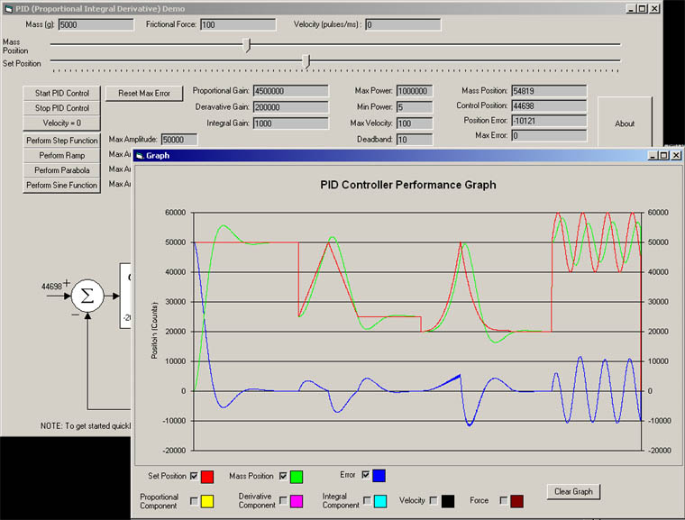



## PID Controller

### Description

Demonstrates how to implement a closed loop PID Controller. A PID controller is a closed loop control system (for real world applications) that is used to control systems that include feedback.

some examples that may include a PID loop:

temperature control (such as a thermostat)

position control (such as a servo)

speed control

Includes a class that allows easy implementation in other applications.

The *.frx files are now included

please vode if you like this code.
 
### More Info
 

             |
---                |---
**Submitted On**   |2002-03-12 14:04:06
**By**             |[Dave Mundy](https://github.com/Planet-Source-Code/PSCIndex/blob/master/ByAuthor/dave-mundy.md)
**Level**          |Intermediate
**User Rating**    |4.9 (49 globes from 10 users)
**Compatibility**  |VB 5\.0, VB 6\.0
**Category**       |[Miscellaneous](https://github.com/Planet-Source-Code/PSCIndex/blob/master/ByCategory/miscellaneous__1-1.md)
**World**          |[Visual Basic](https://github.com/Planet-Source-Code/PSCIndex/blob/master/ByWorld/visual-basic.md)
**Archive File**   |[PID\_Contro616433122002\.zip](https://github.com/Planet-Source-Code/dave-mundy-pid-controller__1-32561/archive/master.zip)

